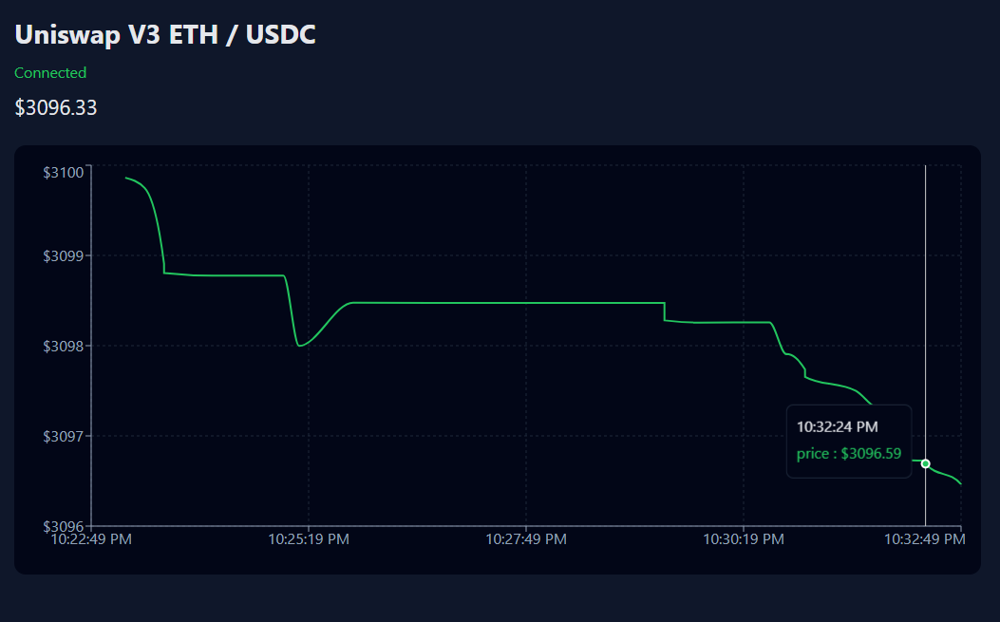

# Uniswap V3 Swap Prices Monitor

Recently, I was building some toy trading bots on Uniswap V3. At some point, I just wanted a simple swap price chart in my application — React, Next.js, TypeScript. Sounds easy, right? Not quite. Doing it for free turned out to be a lot trickier than expected.

Suppose you have a free Alchemy node. Even after navigating the quirks of WebSockets in development mode and figuring out the Uniswap V3 price conversion, you quickly run into a major limitation: the Alchemy free tier only allows historical queries over a very small block range — just 10 blocks per request. Want 10 minutes of data? That would require thousands of tiny requests.

The solution? The Graph API. But even there, it’s no longer completely free: you need an API key. Fortunately, the free tier gives 100,000 requests per month, which is plenty for this kind of project.

Eventually, I got the price chart working. But this little adventure is a perfect illustration of software development: what you think will take an hour can easily turn into days of figuring out APIs, rate limits, and quirks. The good news? The first time is always the hardest.

## How to run it
You need to create `.env.local` first in your root folder.
```
THEGRAPH_API_KEY="<your_key>"
ALCHEMY_RPC_WS = "wss://eth-mainnet.g.alchemy.com/v2/<your_key>"
```
The Graph API key is to be retrieved [here](https://thegraph.com/).
[Alchemy](https://www.alchemy.com/) - get your node, and replace `https://` in the beginning of its URL with `wss://`.

Then, as usual:
```
pnpm install
pnpm run dev
```

## Comments
- It runs for the ETH/USDC pool with 0.005% fee (hardcoded) - you can replace it with any other pool.
- A 10-minute window is also hardcoded, but can be made adjustable if someone is willing to.
